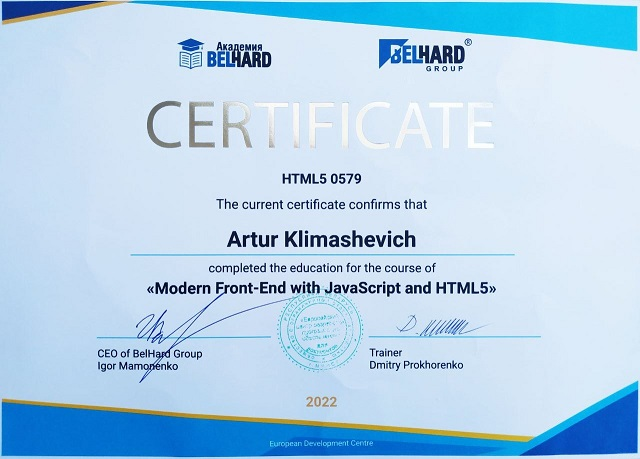

# Artur Klimashevich

_Front End Developer based in Wroclaw PL_

[Email](mailto:arturklime@gmail.com) / [GitHub](https://github.com/Artur-Kli) / [LinkedIn](https://www.linkedin.com/in/artur-klimashevich/) / [Telegram](https://t.me/Artur_FS_Developer)

****************

## 📌 About me:

My first steps in front-end development were at the end of 2018. For several years it was like a hobby in my spare time. By the end of 2022, I had acquired basic knowledge of the entire development stack and decided to make this hobby my main job.
I believe that in 2023, my ability to study will help me fill in the missing knowledge and skills in front-end development for employment. And teamwork will accelerate my growth as a full-stack developer.

****************
## 🌟 Basic Skills:
* Figma, Photoshop
* HTML, CSS, JavaScript
* ES6, TypeScript
* React.js, Redux.js, Next.js
* Node.js, Express.js, Nest.js
* Git and Github, Databases, Apollo GraphQL,
* Mono & Microservice, nx.js, Docker
* Agile & Scrum, Lean principles

****************

## 👩🏼‍💻 Code example:
**Task:** *It is required to find 2 numbers from the sorted array, summing up the number k, with optimal performance*
**Solution:** *Two-pointer method*
```
  const arr = [-3, 0, 2, 4, 5]
  let k = 7

  function twoSum(arr, k) {
    let left = 0
    let right = arr.length - 1
    while(left<right){
      let sum = arr[left] + arr[right]
      if(sum == k) {
        return new Array(arr[left], arr[right])
      } else if (sum < k) {
        left++
      } else {
        right--
      }
    }
    return new Array()
  }

  console.log(twoSum(arr, k)) // [2, 5]
```

****************

# 👩🏼‍🎓 Courses:
* MODERN FRONT-END WITH JAVASCRIPT AND HTML5 (completed)

* RS Schools Course «JavaScript/Front-end.» (in progress)
* JavaScript Manual on [learn.javascript.ru](https://learn.javascript.ru/) (in progress)
* JavaScript Manual on [w3schools](https://www.w3schools.com/) (in progress)